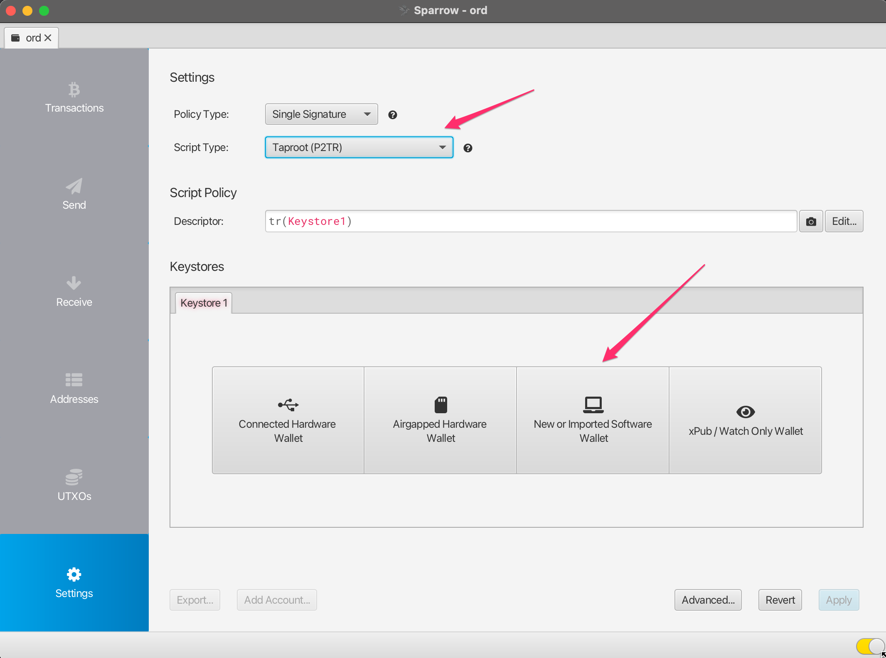
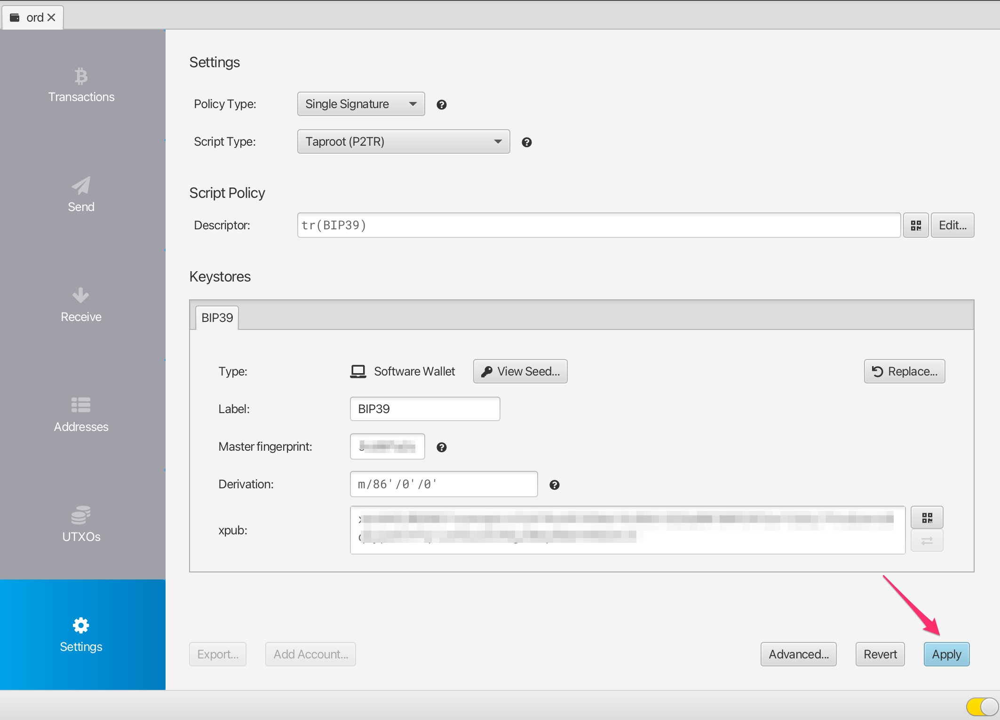
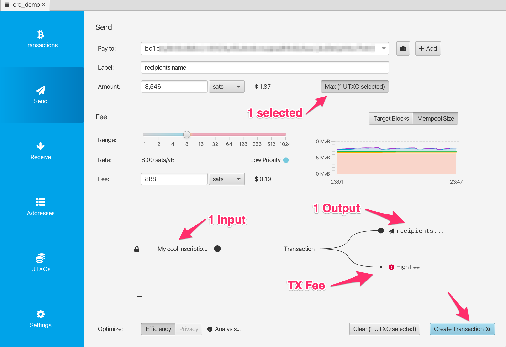
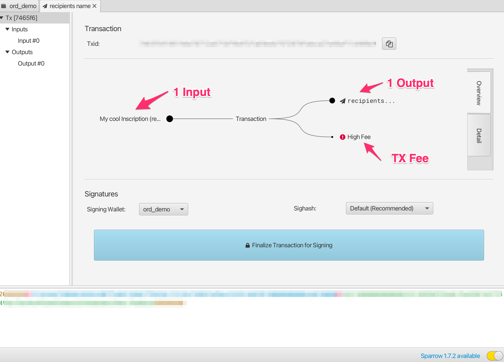
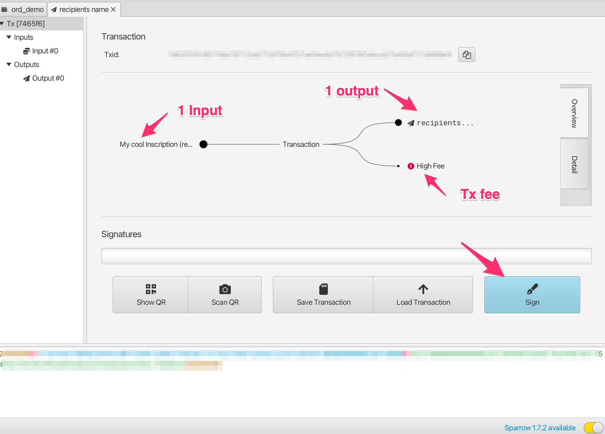
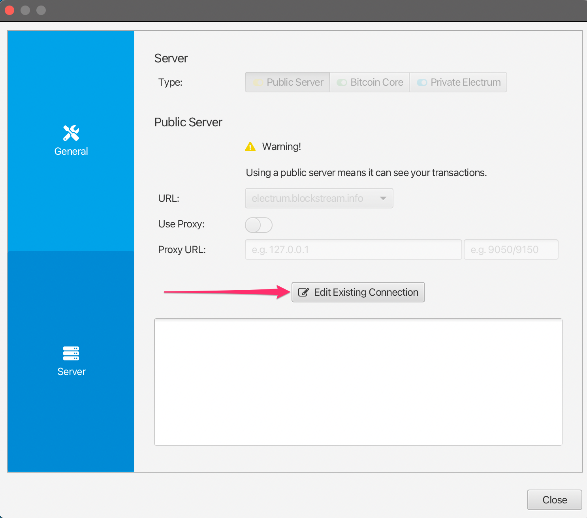

Recolectando Inscripciones y Ordinales con Sparrow Wallet
=====================

Los usuarios que no pueden o no han configurado todavía la billetera [ord](https://github.com/ordinals/ord) pueden recibir inscripciones y ordinales con billeteras alternativas de bitcoin, siempre y cuando sean _muy_ cuidadosos acerca de cómo gastan desde esa billetera.

Esta guía ofrece algunos pasos básicos sobre cómo crear una billetera con [Sparrow Wallet](https://sparrowwallet.com/), la cual es compatible con `ord` y puede ser importada posteriormente en `ord`.

## ⚠️⚠️ ¡Advertencia! ⚠️⚠️
Como regla general, si tomas este enfoque, debes usar esta billetera con el software Sparrow como una billetera solo para recibir.

No gastes ningún satoshi desde esta billetera a menos que estés seguro de lo que estás haciendo. Podrías perder muy fácilmente el acceso a tus ordinales e inscripciones si no haces caso a esta advertencia.

## Configuración de la Billetera y Recepción

Descarga Sparrow Wallet desde la [página de lanzamientos](https://sparrowwallet.com/download/) para tu sistema operativo en particular.

Selecciona `File -> New Wallet` (Archivo -> Nueva Billetera) y crea una nueva billetera llamada `ord`.

Cambia el `Script Type` (Tipo de Script) a `Taproot (P2TR)` y selecciona la opción `New or Imported Software Wallet` (Billetera de Software Nueva o Importada).

Selecciona `Use 12 Words` (Usar 12 Palabras) y luego haz clic en `Generate New` (Generar Nuevo). Deja en blanco la frase de contraseña.

Se generará una nueva frase semilla BIP39 de 12 palabras para ti. Anota esto en algún lugar seguro, ya que es tu respaldo para acceder a tu billetera. NUNCA compartas o muestres esta frase semilla a nadie más.

Una vez que hayas anotado la frase semilla, haz clic en `Confirm Backup` (Confirmar Copia de Seguridad).

Vuelve a ingresar la frase semilla que anotaste y luego haz clic en `Create Keystore` (Crear Almacén de Claves).

Haz clic en `Import Keystore` (Importar Almacén de Claves).

Haz clic en `Apply` (Aplicar). Agrega una contraseña para la billetera si lo deseas.

Ahora tienes una billetera que es compatible con `ord`, y puede ser importada en `ord` usando la Frase Semilla BIP39. Para recibir ordinales o inscripciones, haz clic en la pestaña `Receive` (Recibir) y copia una nueva dirección.

Cada vez que quieras recibir, debes usar una dirección completamente nueva y no reutilizar las direcciones existentes.

Ten en cuenta que bitcoin es diferente a algunas otras billeteras blockchain, ya que esta billetera puede generar un número ilimitado de nuevas direcciones. Puedes generar una nueva dirección haciendo clic en el botón `Get Next Address` (Obtener Siguiente Dirección). Puedes ver todas tus direcciones en la pestaña `Addresses` (Direcciones) de la aplicación.

Puedes agregar una etiqueta a cada dirección, para que puedas hacer un seguimiento de para qué se usó.

## Validando / Viendo Inscripciones Recibidas

Una vez que hayas recibido una inscripción, verás una nueva transacción en la pestaña `Transactions` (Transacciones) de Sparrow, así como un nuevo UTXO en la pestaña `UTXOs`.

Inicialmente, esta transacción puede tener un estado "No confirmado", y tendrás que esperar a que sea minada en un bloque de bitcoin antes de que sea completamente recibida.

Para rastrear el estado de tu transacción, puedes hacer clic derecho sobre ella, seleccionar `Copy Transaction ID` (Copiar ID de Transacción) y luego pegar esa id de transacción en [mempool.space](https://mempool.space).

Una vez que la transacción haya sido confirmada, puedes validar y ver tu inscripción yendo a la pestaña `UTXOs`, encontrando el UTXO que deseas verificar, haciendo clic derecho en `Output` (Salida) y seleccionando `Copy Transaction Output` (Copiar Salida de Transacción). Esta id de salida de transacción luego puede ser pegada en la búsqueda de [ordinals.com](https://ordinals.com).

## Congelando UTXO's
Como se explicó anteriormente, cada una de tus inscripciones está almacenada en una Salida de Transacción No Gastada (UTXO). Quieres tener mucho cuidado de no gastar accidentalmente tus inscripciones, y una manera de hacerlo más difícil es congelar el UTXO.

Para hacerlo, ve a la pestaña `UTXOs`, encuentra el UTXO que quieres congelar, haz clic derecho en `Output` (Salida) y selecciona `Freeze UTXO` (Congelar UTXO).

Este UTXO (Inscripción) ahora no es gastable dentro de Sparrow Wallet hasta que lo descongeles.

## Importando en la cartera `ord`

Para detalles sobre cómo configurar Bitcoin Core y la cartera `ord`, consulta la [Guía de Inscripciones](../inscriptions.md).

Al configurar `ord`, en lugar de ejecutar `ord wallet create` para crear una cartera completamente nueva, puedes importar tu cartera existente usando `ord wallet restore "BIP39 SEED PHRASE"` con la frase semilla que generaste con Sparrow Wallet.

Actualmente hay un [bug](https://github.com/ordinals/ord/issues/1589) que causa que una cartera importada no se escanee automáticamente contra la cadena de bloques. Para solucionar esto, deberás activar manualmente un nuevo escaneo usando la interfaz de línea de comandos de bitcoin core:
`bitcoin-cli -rpcwallet=ord rescanblockchain 767430`

Luego puedes revisar las inscripciones de tu cartera usando `ord wallet inscriptions`.

Ten en cuenta que si has creado previamente una cartera con `ord`, ya tendrás una cartera con el nombre predeterminado y deberás darle un nombre diferente a tu cartera importada. Puedes utilizar el parámetro `--wallet` en todos los comandos de `ord` para hacer referencia a una cartera diferente, por ejemplo:

`ord --wallet ord_from_sparrow wallet restore "BIP39 SEED PHRASE"`

`ord --wallet ord_from_sparrow wallet inscriptions`

`bitcoin-cli -rpcwallet=ord_from_sparrow rescanblockchain 767430`

## Enviando inscripciones con Sparrow Wallet

#### ⚠️⚠️ Advertencia ⚠️⚠️
Aunque es muy recomendable que configures un nodo de bitcoin core y ejecutes el software `ord`, hay ciertas formas limitadas en las que puedes enviar inscripciones desde Sparrow Wallet de manera segura. Ten en cuenta que esto no se recomienda y solo debes hacerlo si comprendes completamente lo que estás haciendo.

Utilizar el software `ord` eliminará gran parte de la complejidad que describimos aquí, ya que puede manejar automáticamente y de manera segura el envío de inscripciones de una manera fácil.

#### ⚠️⚠️ Advertencia Adicional ⚠️⚠️
No uses tu cartera de inscripciones de Sparrow para realizar envíos generales de bitcoins no inscritos. Puedes configurar una cartera separada en Sparrow si necesitas realizar transacciones normales de bitcoin y mantener separada tu cartera de inscripciones.

#### Modelo UTXO de Bitcoin
Antes de enviar cualquier transacción, es importante que tengas un buen modelo mental del sistema de Salida de Transacción No Gastada (UTXO) de Bitcoin. La forma en que funciona Bitcoin es fundamentalmente diferente a muchas otras cadenas de bloques como Ethereum. En Ethereum generalmente tienes una sola dirección en la que almacenas ETH, y no puedes diferenciar entre ninguna de las ETH, simplemente es un valor único del total en esa dirección. Bitcoin funciona de manera muy diferente ya que generamos una nueva dirección en la cartera para cada recepción, y cada vez que recibes sats en una dirección de tu cartera estás creando un nuevo UTXO. Cada UTXO se puede ver y gestionar individualmente. Puedes seleccionar UTXO específicos que quieras gastar y puedes elegir no gastar ciertos UTXO.

Algunas carteras de Bitcoin no exponen este nivel de detalle y simplemente te muestran un valor único que suma todo el bitcoin en tu cartera. Sin embargo, al enviar inscripciones, es importante que utilices una cartera como Sparrow que permita el control de UTXO.

#### Inspeccionando tu inscripción antes de enviar
Como hemos descrito anteriormente, las inscripciones están inscritas en los sats, y los sats se almacenan dentro de los UTXO. Los UTXO son una colección de satoshis con algún valor particular del número de satoshis (el valor de salida). Normalmente (pero no siempre) la inscripción estará inscrita en el primer satoshi del UTXO.

Cuando inspeccionas tu inscripción antes de enviar, lo principal que querrás verificar es en qué satoshi del UTXO está inscrita tu inscripción.

Para hacerlo, puedes seguir la sección [Validando / Visualizando Inscripciones Recibidas](sparrow-wallet.md#validating--viewing-received-inscriptions) descrita anteriormente para encontrar la página de inscripción de tu inscripción en ordinals.com

Allí encontrarás algunos metadatos sobre tu inscripción que se parecen a lo siguiente:

Hay algunas cosas importantes que verificar aquí:
* El identificador de `output` coincide con el identificador del UTXO que vas a enviar.
* El `offset` de la inscripción es `0` (esto significa que la inscripción se encuentra en el primer sat del UTXO).
* El `output_value` tiene suficientes sats para cubrir la tarifa de la transacción (envío) para enviar la transacción. La cantidad exacta que necesitarás depende de la tasa de tarifa que selecciones para la transacción.

Si todo lo anterior es cierto para tu inscripción, debería ser seguro enviarla usando el método siguiente.

⚠️⚠️ Ten mucho cuidado al enviar tu inscripción, especialmente si el valor de `offset` no es `0`. No se recomienda utilizar este método si ese es el caso, ya que podrías enviar accidentalmente tu inscripción a un minero de bitcoin a menos que sepas lo que estás haciendo.

#### Enviando tu inscripción
Para enviar una inscripción, navega a la pestaña `UTXOs` y encuentra el UTXO que previamente validaste que contiene tu inscripción.

Si previamente congelaste el UTXO, necesitarás hacer clic derecho en él y seleccionar `unfreeze`.

Selecciona el UTXO que quieres enviar, y asegúrate de que sea el _único_ UTXO seleccionado. Deberías ver `UTXOs 1/1` en la interfaz. Una vez que estés seguro de esto, puedes pulsar `Send Selected`.

A continuación, se te presentará la interfaz de construcción de transacciones. Hay algunas cosas que debes comprobar aquí para asegurarte de que este es un envío seguro:

* La transacción debe tener solo 1 entrada, y esta debe ser el UTXO con la etiqueta que quieres enviar.
* La transacción debe tener solo 1 salida, que es la dirección/etiqueta a donde quieres enviar la inscripción.

Si tu transacción se ve diferente, por ejemplo, tienes múltiples entradas, o múltiples salidas, entonces esta puede no ser una transferencia segura de tu inscripción, y debes abandonar el envío hasta que entiendas más, o puedas importar en la cartera `ord`.

Debes establecer una tarifa de transacción apropiada; Sparrow generalmente recomendará una razonable, pero también puedes consultar [mempool.space](https://mempool.space) para ver cuál es la tarifa recomendada para enviar una transacción.

Debes agregar una etiqueta para la dirección del destinatario; una etiqueta como `alice address for inscription #123` sería ideal.

Una vez que hayas comprobado que la transacción es segura utilizando las comprobaciones anteriores y estés seguro de enviarla, puedes hacer clic en `Create Transaction`.

Aquí de nuevo puedes verificar que tu transacción sea segura, y una vez que estés seguro puedes hacer clic en `Finalize Transaction for Signing`.

Aquí puedes revisar todo una vez más antes de hacer clic en `Sign`.

Y luego, de hecho, obtienes una última oportunidad para revisar todo antes de hacer clic en `Broadcast Transaction`. Una vez que transmitas la transacción, se enviará a la red de Bitcoin, y comenzará a propagarse en el mempool.

Si quieres rastrear el estado de tu transacción, puedes copiar el `Transaction Id (Txid)` y pegarlo en [mempool.space](https://mempool.space)

Una vez que la transacción haya sido confirmada, puedes verificar la página de inscripción en [ordinals.com](https://ordinals.com) para validar que se haya movido a la nueva ubicación y dirección de salida.

## Solución de Problemas

#### ¡Sparrow Wallet no muestra una transacción/UTXO, pero puedo verlo en mempool.space!

Asegúrate de que tu cartera esté conectada a un nodo de Bitcoin. Para validar esto, dirígete a `Preferences`-> `Server` settings, y haz clic en `Edit Existing Connection`.

Desde allí puedes seleccionar un nodo y hacer clic en `Test Connection` para validar que Sparrow pueda conectarse con éxito.

